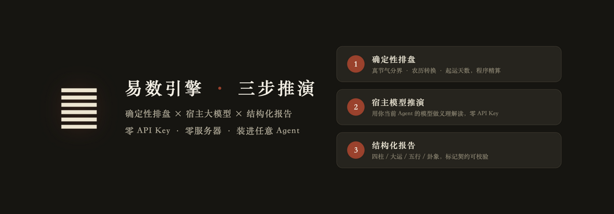
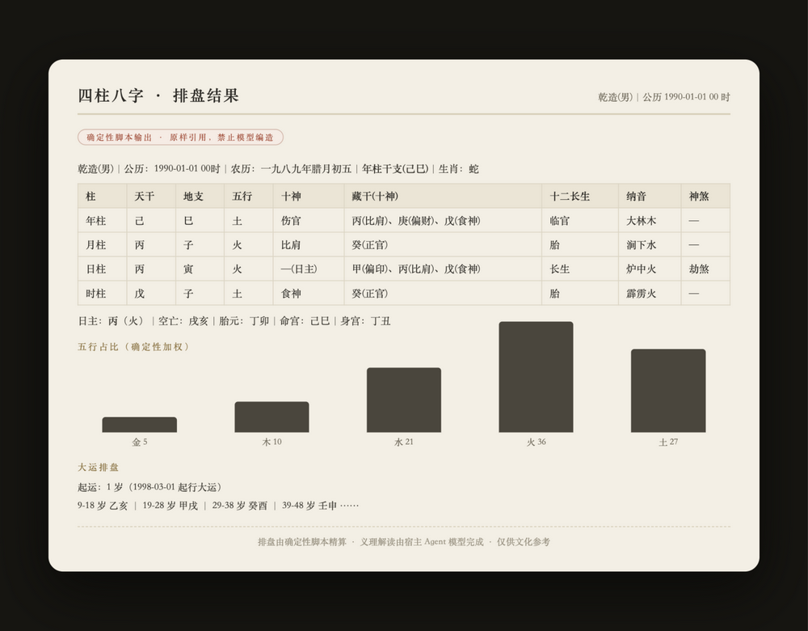

<div align="center">



**八字 · 紫微斗数 · 周易卦象 —— 装进任意 Agent 的命理推演技能**

[](LICENSE)


*[English](#english)* ｜ 完整体验：**[fatescroll.ai](https://fatescroll.ai)**

</div>

---

## 这是什么

一个 [SKILL.md](https://agentskills.io) 格式的命理推演技能：**排盘由确定性脚本精算**（真节气分界、农历转换、起运天数均为程序运算，带锁定向量回归保护），**义理解读由宿主 Agent 自带的模型完成**——装在哪个 Agent（WorkBuddy / Qoder / ZCode / Claude Code…），就用谁的模型。零 API Key、零服务器、离线可用。

> 与普通「AI 算命」提示词包的本质区别：所有干支、十神、大运、星曜都是**脚本既算事实**，提示词强制模型原样引用、禁止编造——模型只负责解读，不负责算命。

**引擎与 [fatescroll.ai](https://fatescroll.ai)（Web/App 完整版）同源**，经真实应用向量回归验证。

## 安装

### WorkBuddy（腾讯）
设置 → 技能 → **上传技能** → 选择 [fatescroll-divination-skill.zip](fatescroll-divination-skill.zip) 导入，自动完成配置。

### 其他支持 SKILL.md 的 Agent
```bash
# ZCode / Claude Code / Qoder 等（用户级目录，重启会话生效）
mkdir -p ~/.agents/skills
cp -R skills/fatescroll-divination ~/.agents/skills/
```

## 使用

直接对话即可触发：

| 你说 | 它做 |
|---|---|
| 「帮我看个八字」 | 索要出生日期/时辰/性别 → 脚本排盘 → 命格解读 |
| 「我 2027 年运势如何」 | 流年推演（目标日期自动传参） |
| 「帮我合婚」 | 双方各自排盘 + 八字合婚框架 |
| 「今天卦象如何」 | 当日本卦/互卦（按文王卦序确定性获取） |
| 「紫微命盘」 | 十二宫 + 本命四化 + 格局（Node 运行时） |

生成时会先执行确定性排盘脚本，输出形如：



## 引擎可信度

- 四柱算法带**锁定向量回归测试**（例：`1990-01-01 → 己巳/丙子/丙寅/戊子`）；
- **双运行时**：Node（首选，含紫微斗数，esbuild 自包含单文件）与 Python 3 标准库（兜底，内置 MIT 许可的 lunar_python），同输入输出一致；
- 八大命理分析框架、周易断事 8 法、合婚 6 维度随包内置（references/）；
- **伦理红线内置**：危机话题自动停止推演并提供心理援助热线；全部输出附「文化参考」免责声明。

## 目录

```
skills/fatescroll-divination/
├── SKILL.md                  # 触发条件与工作流
├── references/               # 八字 8 框架 / 周易 8 框架 / 合婚 6 框架 / 报告格式 / 伦理
└── scripts/
    ├── fatescroll_calc.cjs   # Node 排盘引擎（八字+紫微+卦象，自包含）
    ├── fatescroll_calc.py    # Python 零依赖兜底
    ├── lunar_python/         # MIT 历法库内置副本
    └── claim_account.sh      # 可选：绑定 fatescroll.ai 账号（跨设备同步）
```

## 生态

- **[fatescroll.ai](https://fatescroll.ai)** —— Web 完整版：生辰档案、命盘可视化、七位 AI 命理师对话、精装命书/运书（BYOK：模型由你自配，浏览器直连）；
- 本技能与 Web/App **共用同一排盘引擎**，结果口径一致。

## 说明

- 本技能内容属传统文化娱乐/文化参考，不构成任何专业建议；请相信科学、理性看待；
- License: MIT（内置第三方库 lunar_python / iztro 均为 MIT）。

---

<a name="english"></a>

## English

A [SKILL.md](https://agentskills.io) skill for Chinese metaphysics (BaZi · Zi Wei Dou Shu · I Ching hexagrams). **Charts are computed by a deterministic script** (true solar-term boundaries, lunar calendar conversion, luck-cycle start dates — all programmatic, regression-locked), while **interpretation is done by your host agent's own LLM** — zero API keys, zero servers, works offline.

**Install**: WorkBuddy → Skills → upload `fatescroll-divination-skill.zip`; or copy `skills/fatescroll-divination` into your agent's skills directory (`~/.agents/skills/`). Just ask "帮我看个八字" (read my BaZi chart) to trigger.

**Trust**: the engine is shared with the [FATESCROLL](https://fatescroll.ai) production app and guarded by locked-vector regression tests (e.g. `1990-01-01 → 己巳/丙子/丙寅/戊子`). Crisis topics stop the reading and show a helpline. MIT licensed.
